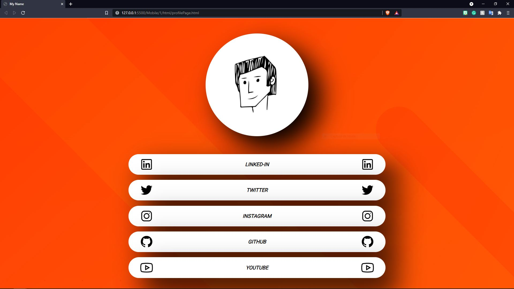
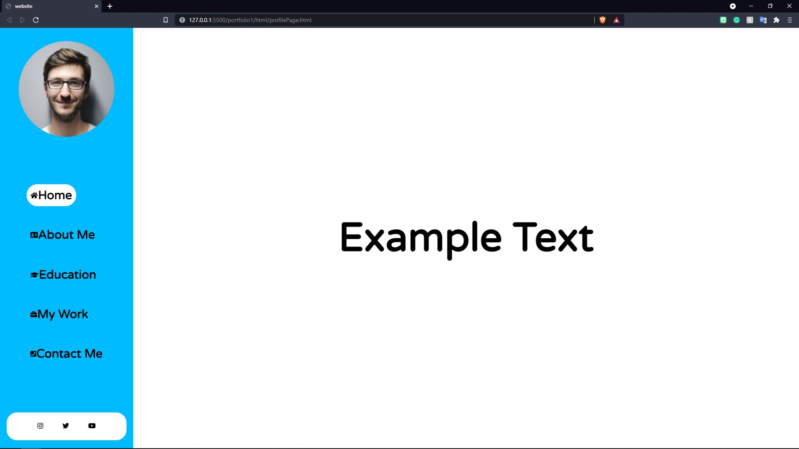
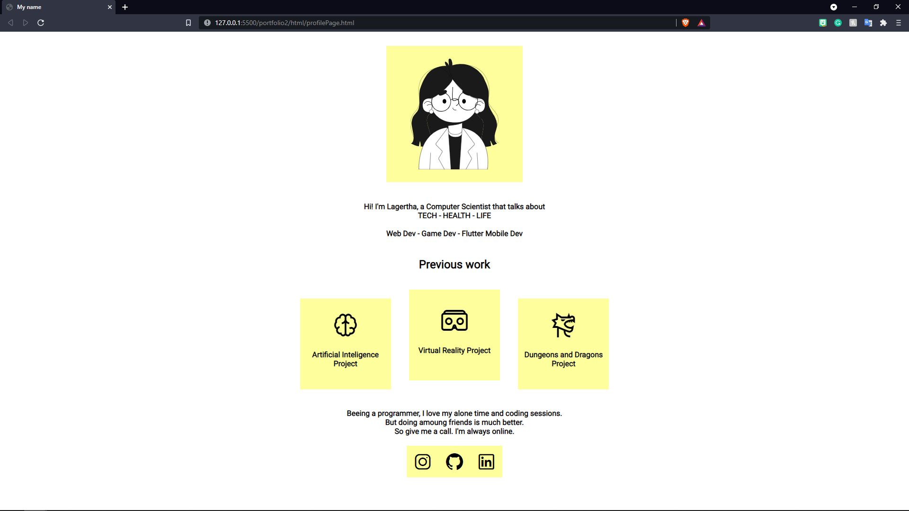

# Personal-Websites

This is a repository that is made as a portfolio of web development websites. But all of the pojects are free to use for any purpose.
 Any support is appreciated and can be made through paypal.
 my email is rubemchrist@gmail.com

**Mobile Focused**

| Mobile/1  | 
| ------------- |
|  |

**Web Focused**

| portfolio1| portfolio2| 
| ------------- | ------------- |
|  |  |

| portfolio3| coming soon|
| ------------- | ------------- |
|  |  |
